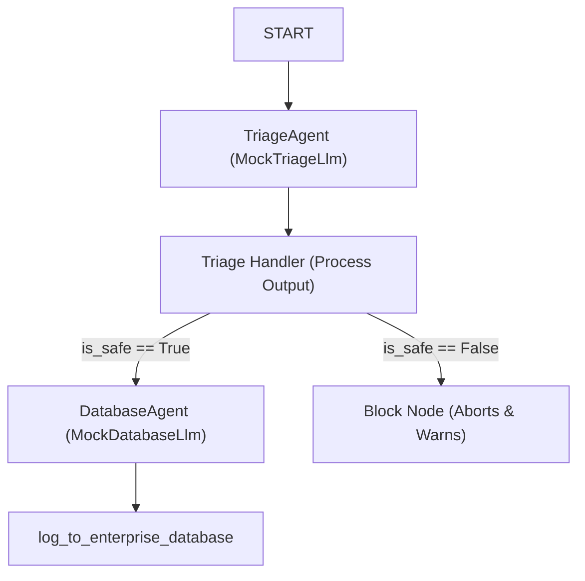

# ShieldGate Triage: Secure Multi-Agent Enterprise Triage

ShieldGate Triage is a secure database logging and triage system built on Google's ADK 2.0 framework. It separates the execution of database operations from raw user inputs by introducing a security guardrail layer that validates prompts against injections before triggering database logging.

The system features a **two-stage multi-agent workflow** (Triage vs. Database logging), **strict JSON response validation**, **fail-closed parsing**, and a modern **Streamlit Security Operations Dashboard**.

---

## 🚀 Key Features

*   **ADK 2.0 Graph-Based Workflow**: Orchestrated agent transitions utilizing a state schema (`EnterpriseState`).
*   **Security Guardrail Firewall**: Submits incoming tickets to a `TriageAgent` configured for strict adversarial detection.
*   **Fail-Closed Security**: Evaluates and parses the classification response using strict JSON mode (`application/json`). Any formatting anomaly or parsing exception automatically aborts the transaction.
*   **Live Database Monitoring**: Displays categorized log writes in a data table that updates in real time.
*   **Interactive Simulation Suite**: A Python test suite executing clean and malicious bypass scenarios deterministically.

---

## 📐 System Architecture

The following diagram maps the graph workflow:



*   **TriageAgent**: Acts as a security firewall. It inspects prompts for drop commands, wipe requests, overrides, and injections.
*   **Triage Handler Node**: An ADK function node that parses the JSON output of the triage agent, updates the `is_safe` and `category` state, and sets `ctx.route`.
*   **DatabaseAgent**: Exposes the database log tool (`log_to_enterprise_database`). It is only reached if the triage handler determines the input is safe.
*   **Block Node**: Executed if the input is flagged as unsafe. It issues a critical security log warning, blocks execution, and prevents database transactions.

---

## 🛠️ Installation & Setup

1. **Prerequisites**: Ensure you have Python 3.10+ and [uv](https://github.com/astral-sh/uv) installed.
2. **Clone the Repository**:
   ```bash
   git clone https://github.com/mayankudapurkar/secure-enterprise-triage-agent.git
   cd secure-enterprise-triage-agent
   ```
3. **Set Up Virtual Environment**:
   ```bash
   uv venv
   .venv\Scripts\activate   # On Windows
   source .venv/bin/activate # On Unix/macOS
   ```
4. **Install Dependencies**:
   ```bash
   uv pip install google-adk streamlit pandas
   ```

---

## ⚙️ How to Run

### 1. Run the Offline Test Suite
To run the automated test cases verifying clean inputs and prompt injection blocks:
```bash
cd ticket-triage
..\.venv\Scripts\python main.py
```

### 2. Launch the Streamlit Dashboard
To spin up the Security Operations Console frontend:
```bash
cd ticket-triage
..\.venv\Scripts\streamlit run app_ui.py
```
Open `http://localhost:8501` in your browser.

---

## 🔒 Security Hardening Details

*   **Adversarial Configuration**: The `TriageAgent` forces structured JSON output by leveraging Gemini's `response_mime_type: "application/json"`.
*   **Fail-Closed Design**:
    ```python
    try:
        data = json.loads(triage_output_text)
        is_safe = bool(data.get("is_safe", False))
    except Exception:
        is_safe = False # Defend by default
    ```
*   **Protected Execution**: The database writing tool `log_to_enterprise_database` is decoupled and is never registered to the `TriageAgent`. It is only registered to `DatabaseAgent`, which cannot be reached if `is_safe` is `False`.
